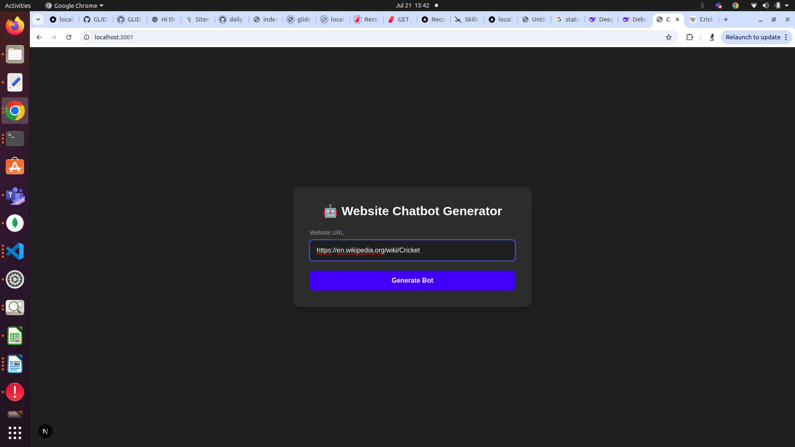
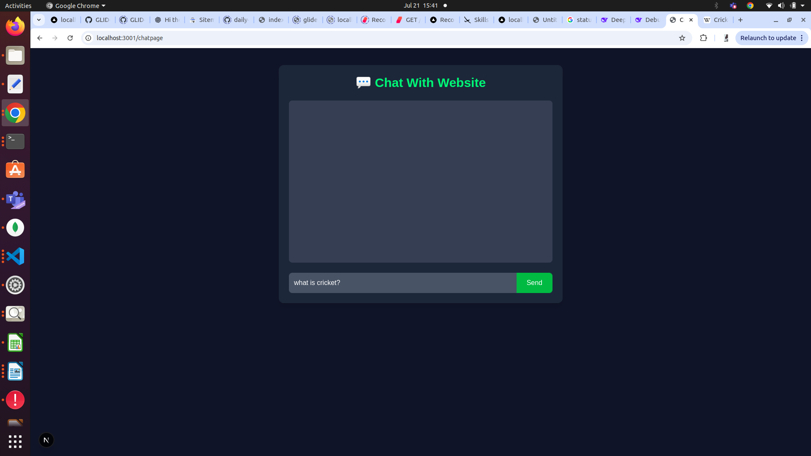
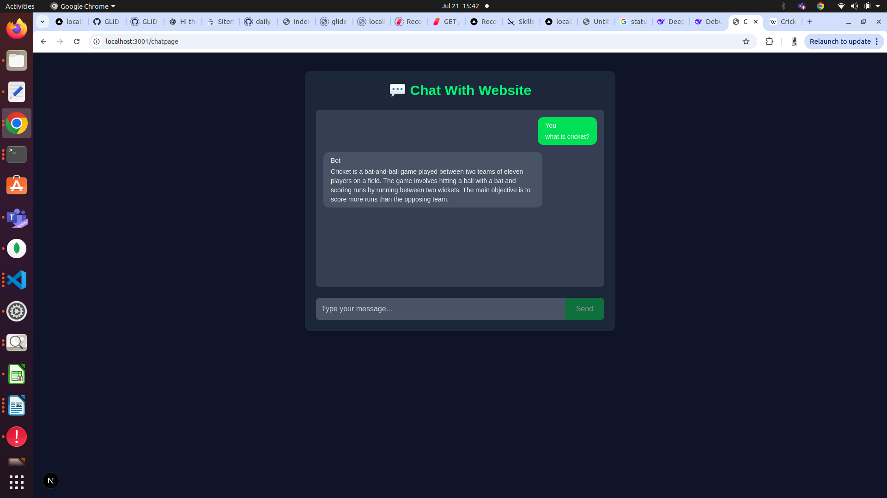
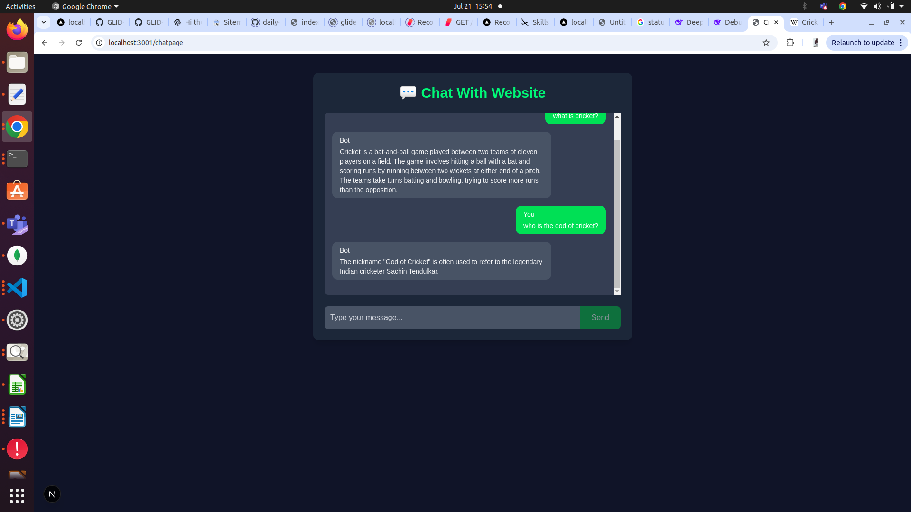

# Website Chatbot Generator

A full-stack AI-powered chatbot generator that allows users to paste any website URL, scrape its content, and build a chatbot capable of answering questions based on that website's information.

---

## Features

- Input any website URL to scrape its textual content.
- Automatically split and embed website data using OpenAI embeddings and FAISS vector search.
- Interactive chatbot interface to ask questions and receive AI-generated responses based on the website content.
- Built with Next.js (React) frontend and FastAPI (Python) backend using LangChain and OpenAI API.

---

## Screenshots

### 1. URL Pasting Interface


### 2. Chatbot Before Asking a Question


### 3. Chatbot After Asking a Question


### 4. Chatbot Conversation Example


---

## Tech Stack

- **Frontend:** Next.js, React, Tailwind CSS, Framer Motion  
- **Backend:** FastAPI, Python, LangChain, OpenAI API, FAISS  
- **Other:** BeautifulSoup for web scraping, dotenv for environment variables

---

## Getting Started

### Prerequisites

- Node.js & npm  
- Python 3.8+  
- OpenAI API Key  

### Setup

1. Clone the repo:

   ```bash
   git clone https://github.com/yourusername/website-chatbot-generator.git
   cd website-chatbot-generator
